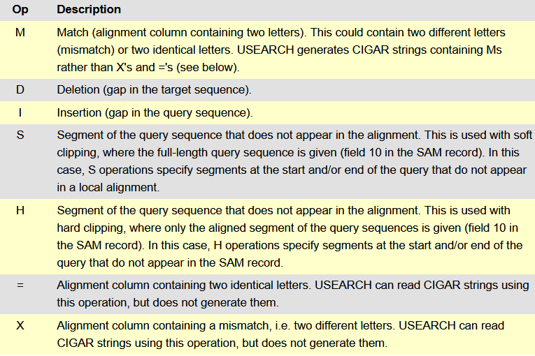

<h1 align="center">BWA</h1>

> This repository is not intended to represent work, but rather to store and transmit information.

For `SAM` and `pairwise` files *word wrap* should be disabled

### Stages

1. **BWA** indexes two `fasta` sequences
2. **BWA** aligns these two sequences
3. **samtools** converts `sam` file to `bam` file (*currently optional*)
4. **samtools** sorts `bam` file (*currently optional*)
5. **sam2pairwise** converts `sam` file to *pairwise* (`txt` file) (*currently optional*)

### Requirements

- **BWA**: http://bio-bwa.sourceforge.net
- **Samtools**: https://www.htslib.org
- **sam2pairwise**: https://github.com/mlafave/sam2pairwise

`sudo apt install bwa samtools`

### Contents

- `large1/large_genome1.fasta`: [NCBI](https://www.ncbi.nlm.nih.gov/nuccore/CP003305.1)
- `large1/large_genome2.fasta`: [NCBI](https://www.ncbi.nlm.nih.gov/nuccore/CP000766.3)
---
- `large2/large_genome1.fasta`: [NCBI](https://www.ncbi.nlm.nih.gov/nuccore/NZ_CP009625.1)
- `large2/large_genome2.fasta`: [NCBI](https://www.ncbi.nlm.nih.gov/nuccore/NZ_CP007695.1)
---
- `large3/large_genome1.fasta`: [NCBI](https://www.ncbi.nlm.nih.gov/nuccore/NZ_CP009626.1)
- `large3/large_genome2.fasta`: [NCBI](https://www.ncbi.nlm.nih.gov/nuccore/NZ_CP007696.1)
---
- `large4/large_genome1.fasta`: [NCBI](https://www.ncbi.nlm.nih.gov/nuccore/CP002079)
- `large4/large_genome2.fasta`: [NCBI](https://www.ncbi.nlm.nih.gov/nuccore/AM040265.1)
---
- `large5/large_genome1.fasta`: [NCBI](https://www.ncbi.nlm.nih.gov/nuccore/864354655)
- `large5/large_genome2.fasta`: [NCBI](https://www.ncbi.nlm.nih.gov/nuccore/15603881)
---
- `large6/large_genome1.fasta`: [NCBI](https://www.ncbi.nlm.nih.gov/nuccore/134045046)
- `large6/large_genome2.fasta`: [NCBI](https://www.ncbi.nlm.nih.gov/nuccore/CP002913.1)
---
- `large7/large_genome1.fasta`: [NCBI](https://www.ncbi.nlm.nih.gov/nuccore/NC_015758.1)
- `large7/large_genome2.fasta`: [NCBI](https://www.ncbi.nlm.nih.gov/nuccore/NC_016946.1)

### Usefull

https://en.wikipedia.org/wiki/Burrows%E2%80%93Wheeler_transform

https://ru.wikipedia.org/wiki/SAMtools

https://en.wikipedia.org/wiki/SAM_(file_format)

http://bio-bwa.sourceforge.net/bwa.shtml#3

http://bio-bwa.sourceforge.net/bwa.shtml#4

CIGAR

